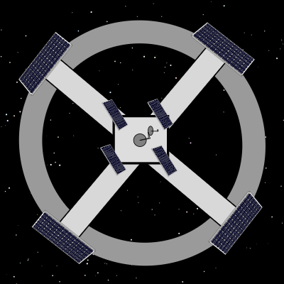

# CentriSpace
<h1>Simulador de Gravidade Centrifuga em Estação Espacial</h1>

Simula a geração de Gravidade artificial em uma estação espacial usando o efeito centrifuga, que ocorrer quando há um movimento rotaciional no ambiente proporciando uma aceleração centripeta sobre os objetos.

Autores:  
Stênio Vinicios de Medeiros 
Portifolio: <a href="https://steniovm.github.io/steniovm/"  alt="Meu portifolio de projetos">https://steniovm.github.io/steniovm/</a> 
Email: <a href="mailto:steniovm@gmail.com"  alt="Meu email">steniovm@gmail.com</a>  
Renam Magalhães 
Linkedin: <a href="https://www.linkedin.com/in/renan-mello-magalh%C3%A3es-b1828951/"  alt="Meu Linkedin">https://www.linkedin.com/in/renan-mello-magalhães-b1828951/</a>  

